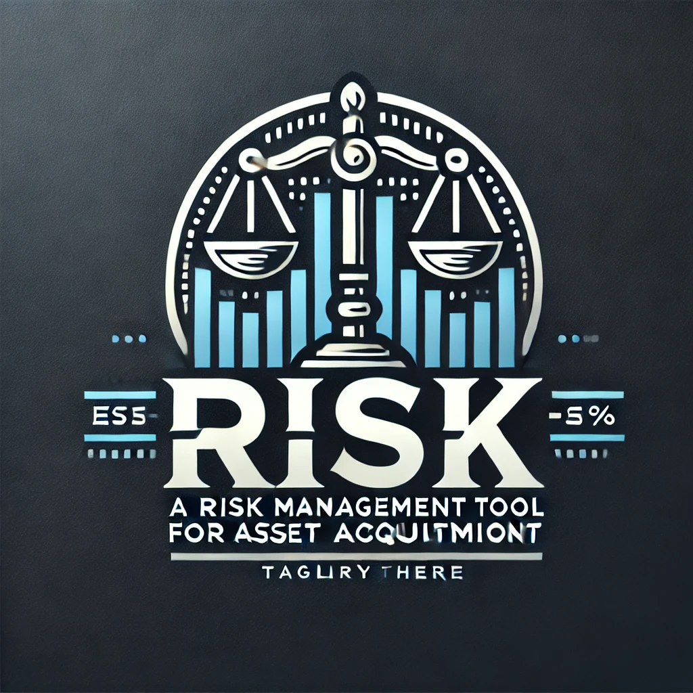
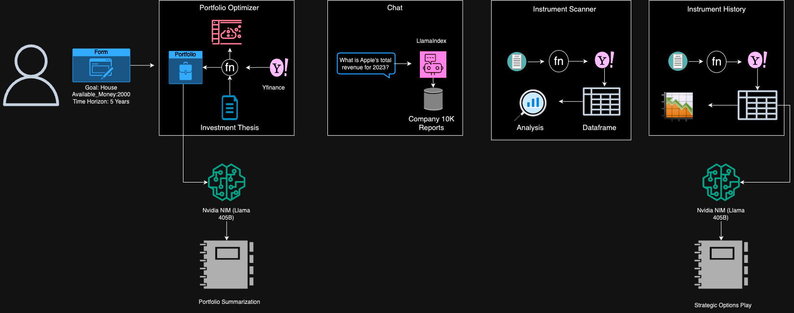
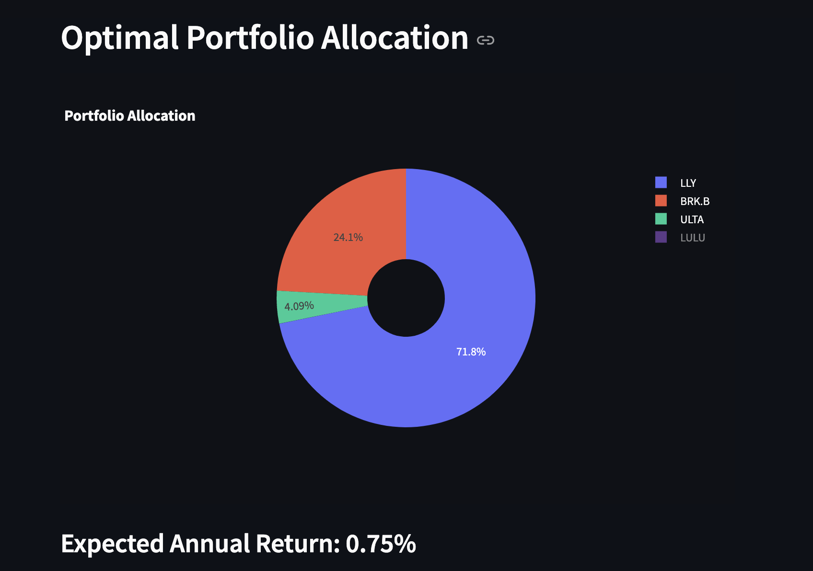
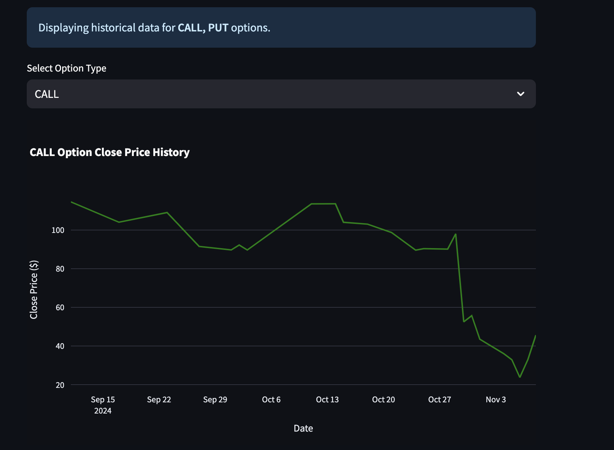
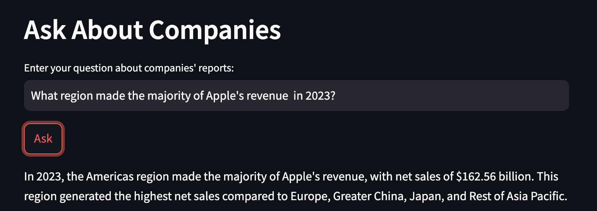

# 

[Watch the Demo Video](https://www.youtube.com/watch?v=ZJJTWE1hNQE&t=0s)

# Risky: A Risk Management Tool for Asset Acquisition

Welcome to **Risky** – the open-source robo-advisor built to support risk management and strategic asset acquisition. With Risky, you gain access to sophisticated portfolio recommendations tailored to your financial goals, risk tolerance, and investment timeline. Driven by cutting-edge language models and our proprietary Investment Thesis, Risky is your intelligent guide to optimized, data-backed asset management.

---

## Table of Contents
- [Overview](#overview)
- [Features](#features)
- [Why Risky?](#why-risky)
- [Architecture](#architecture)
- [Installation](#installation)
- [Usage](#usage)
- [Screenshots](#screenshots)
- [License](#license)

---

## Overview

Risky enables you to create customized investment portfolios with tools for:
- **Goal Tracking**: Define and follow your financial objectives.
- **Stock Visualization**: Analyze market trends with clear, informative charts.
- **Options Data Analysis**: Review historical options data to support long-term planning.
- **Portfolio Optimization**: Tailor your portfolio based on specific risk preferences and acquisition targets.

At the heart of Risky is its **Investment Thesis** – a curated knowledge base inspired by experienced financial advisors. This thesis provides a distilled view of the market, adapting dynamically to align with your goals and preferred timeline.

---

## Features

- **User Profile Management**: Set up profiles with tailored financial goals and risk levels.
- **Portfolio Optimization**: Generate optimized portfolios guided by Risky’s Investment Thesis.
- **Real-Time and Historical Data**: Access up-to-date stock and historical options data.
- **Investment Thesis**: A powerful knowledge base of pre-vetted assets designed to inform strategic acquisitions.
- **LLM-Powered Insights**: Leverages NVIDIA NIM 405B LLM and LLama Index for intelligent analysis and interactive conversations.
- **Options Visualization**: Review historical options performance and potential risk factors over time.
- **Interactive Frontend**: Built on Streamlit for a streamlined and user-friendly experience.

---

## Why Risky?

Legacy tools like **Option Profit Calculator** or **Optionistics** are often static, requiring extensive manual data entry for single-point calculations. These tools can fall short in providing actionable guidance for long-term asset acquisition.

**Risky** changes the game by integrating an **Investment Thesis** that functions as a dynamic advisor. This distilled knowledge repository guides asset selection and acquisition based on historical data and projected performance, offering strategic insights that legacy tools can’t match.

---

## Architecture

# 

Risky is built with a modular, scalable structure, featuring clear separations between the frontend and backend for ease of customization and future upgrades.

### Core Technologies

- **NVIDIA NIM 405B LLM Instruct Model**: Powers advanced insights, supporting strategic decision-making.
- **LLama Index**: Facilitates efficient document retrieval and analysis, enhancing interactive exploration of financial information.

### Core Components

- **Investment Thesis (investment_thesis.csv)**: Acts as the “playbook” for financial decisions, driving informed asset selection with historical and projected performance insights.
- **Portfolio Optimization Engine**: Allocates assets based on user-defined goals, ensuring alignment with acquisition strategies.
- **Data Processing**: Integrates real-time stock data and historical options information for ongoing market awareness.
- **Options Visualization**: Provides interactive performance charts to review options across various timeframes.

### Data Storage

- **User Profiles**: Stores customized profiles, goals, risk preferences, and acquisition timelines.
- **Historical Data**: Includes stock and options data to support robust analysis and risk management.

---

## Installation

To get started with Risky, follow these steps.

### Prerequisites

- Python 3.11 or higher
- Git

### Steps

1. **Clone the Repository**

   ```sh
   git clone <repository-url>
   cd Robo_Advisor

2.	Set Up Virtual Environment

	python3 -m venv venv
	source venv/bin/activate  # On Windows use `venv\Scripts\activate`


3.	Install Dependencies

		pip install -r backend/requirements.txt
		pip install -r frontend/requirements.txt


4.	Configure Environment Variables

	```sh
	•	Create a .env file in the root directory and add your OpenAI and NVIDIA NIM API keys.

Usage

	1.	Run the Application

streamlit run frontend/app.py


	2.	Access the Application
	•	Open your browser and navigate to http://localhost:8501.
	3.	Explore Risky’s Tools
	•	Set financial goals, select a risk tolerance, and specify your available funds.
	•	Use portfolio optimization, stock analysis, and options visualization to build and fine-tune your portfolio.
	•	Tap into the Investment Thesis to compare asset performance relative to your timeline and acquisition goals.

## Screenshots

### 1. Portfolio Allocation



> *This screenshot shows an example of optimal asset allocation tailored to user-defined goals and risk tolerance.*

---

### 2. Options Performance



> *Here, historical options performance data is visualized, helping users understand returns over different periods for informed decision-making.*



> *This image illustrates the "Chat with Documents" feature, enabling users to query financial data and receive insights tailored to their acquisition strategy, facilitating informed decision-making.*

[FAQ](Robo_Advisor/docs/faq.md)

For additional information, troubleshooting tips, and frequently asked questions, see the [FAQ](Robo_Advisor/docs/faq.md).

License

Risky is licensed under the GNU General Public License v3.0.
